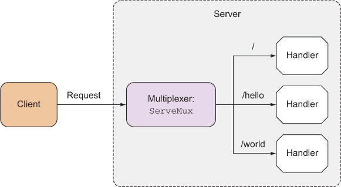
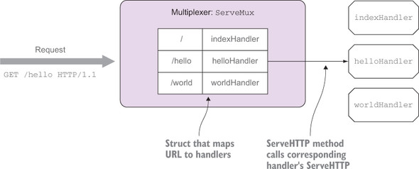

# 接受请求
## 处理器和处理函数
如果开发者，创建一个处理器并将它与服务器进行绑定，一次代替原来正在使用的默认多路复用器。这意味这服务不会再通过URL匹配来将请求路由至不同的处理器
，二十直接使用同一个处理器来处理所有请求，因此，不论浏览器访问什么地址，服务器都返回同样的响应。  
但是我再WEB应用绝大多数使用多路复用器，原因：对某些特殊用的服务器来说，只使用一个处理器也许就可以很好地完成工作量；但是不同URL有不同需求，而不是
一成不变地只返回一种响应。  
### 使用多个处理器
为了使用多个处理器，不通过Server结构的Handler字段指定处理器，而是让服务器使用默认的DefaultServeMux作为处理器，然后通过http.Handle函数将处理器
绑定到DefaultServeMux.Handle函数来源于http包，但它实际上是ServeMux结构的方法：这些函数是为了操作便利而创建的函数，调用它们等同于调
用DefaultServeMux的某个方法。比如这里调用http.Handle实际就是再调用DefaultServeMux的Handle方法。  
### 处理器函数
实际上就是与处理器拥有相同行为的函数：这些函数与ServeHTTP方法拥有相同的签名，即，它们接收ResponseWriter和指向Request结构的指针作为参数。
[详细代码点击](handlefunc.go)处理器函数实现原理：GO语言有一种HandleFunc函数类型，它可以把一个带有正确签名的函数F转换成一个带有方法F的
Handler
### ServeMux和DefaultServeMux
ServeMux是一个HTTP请求多路复用器，它负责接收HTTP请求并根据请求中的URL将请求重定向到正确的处理器。
  
ServeMux结构包含了一个映射，这个映射会将URL映射至相应的处理器。因为ServeMux结构也实现了ServeHTTP方法，所以他也是一个处理器。
当ServeMux的ServeHTTP方法接收到一个请求的时候，它会在结构的映射里找出与被请求URL最为匹配的URL，然后调用与之相对应的处理器的ServeHTTP方法。  
工作原理如下：  

ServeMux是一个结构而不是接口，所以DefaultServeMux并不是ServeMux的实现。DefaultServeMux实际上是ServeMux的一个实例，并且所有引入了net/http
标准库都可以使用这个实例。当用户没有为Serve结构指定处理器时，服务器就会使用DefaultServeMux作为ServeMux的默认实例。  
如果被访问的URL/不存在，可以绑定根URL，那么匹配不成功 的URL将会根据URL的层级进行下降，并最终降落在根URL上，也就上图中indexHandler来处理这个URL。  
最小惊讶原则：  
> 指的是我们在进行设计的时候，应该做哪些合乎常理的事情，识事物的行为总是显而易见、始终如一并且合乎情理

**ServeMux缺点：** ServeMux的一个缺陷是无法使用变量实现URL模式匹配。虽然在浏览器请求/threads的时候，使用ServeMux可以很好地获取并显示论坛中的
所有帖子，但如果浏览器请求的是/thread/123，那么要获取并显示论坛里面ID为123的帖子就会变得非常困难。程序必须对URL进行语法分析才能提取出URL
当中的帖子ID。此外，因为受ServeMux实现URL模式匹配的方式所限，如果我们想要通过/thread/123/post/456这样的URL从ID为123的帖子中获取ID为456的
回复，就必须在程序里面进行大量复杂的语法分析，并因此给程序带来额外的复杂度。  

### 高效轻量级第三方多路复用器——HttpRouter
[使用HttpRouter例子](UsingHttpRouter.go)这里代码使用`httprouter.New()`来创建一个多路复用器。这个程序不再使用`HandleFunc`绑定处理器函数
，而是直接把处理器函数与给定的HTTP方法进行绑定：`mux.GET("/hello/:name",hello)`。这段代码会把给定URL的GET方法与hello处理器函数进行绑定，
当浏览器向这个URL发送GET请求时，hello函数会被调用，但如果浏览器向这个URL发送除GET请求之外的其他请求，hello函数不会被调用。  
跟之前的处理器函数相比，现在的hello处理器函数也发生了变化，它不再接受两个参数，而是接受3个参数。其中第三个参数Params就包含了之前提到的
剧名参数，具名参数的值可以在处理器内部通过ByName方法获取：
```
func hello(w http.ResponseWriter, r *http.Request, p httprouter.Params){
  fmt.Fprintf(w, "hello, %s!\n", p.ByName("name"))
}
```
